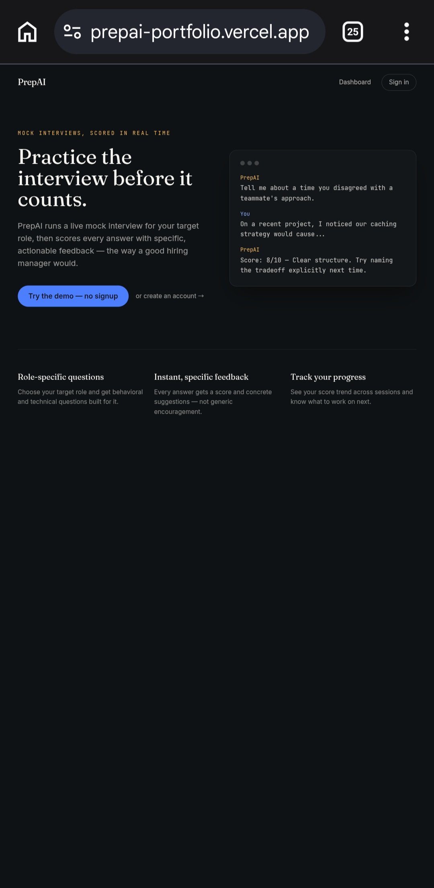
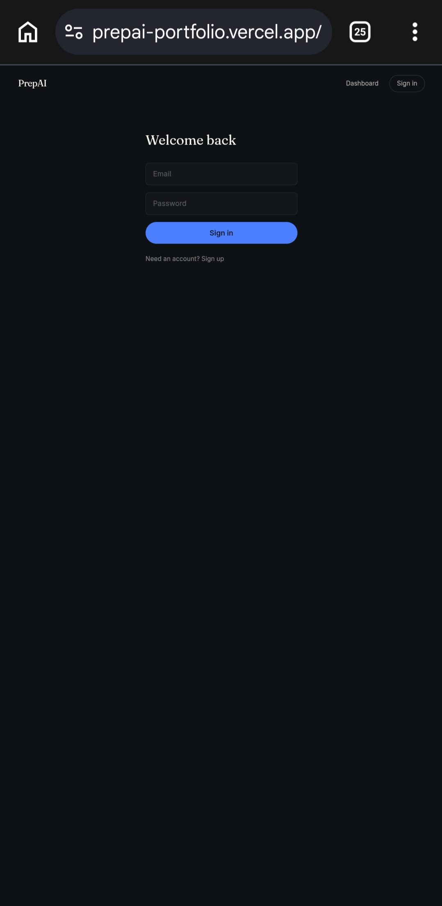
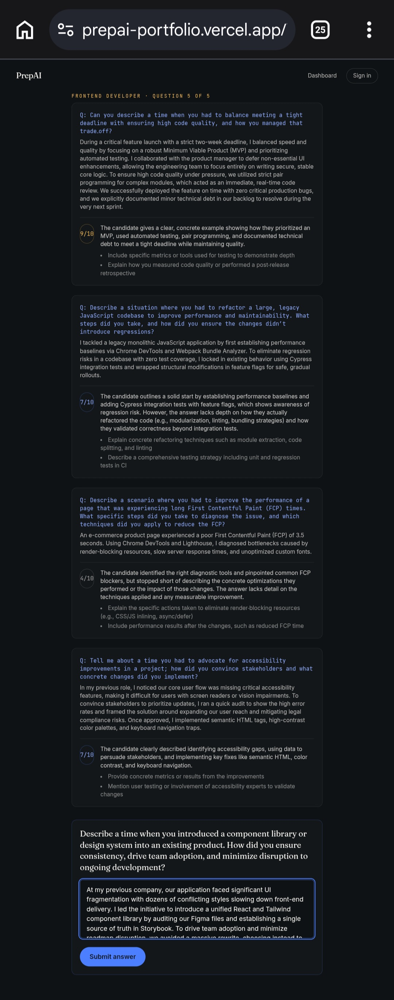
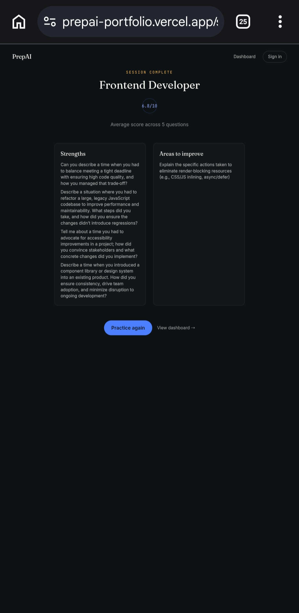

# PrepAI

**Practice the interview before it counts.**

PrepAI is a full-stack mock interview platform. Pick a role, answer AI-generated interview questions in a live chat flow, and get an instant score with concrete, specific feedback — the way a good hiring manager would give it.

[**Live Demo →**](https://prepai-portfolio.vercel.app) &nbsp;·&nbsp; No signup required, click "Try the demo"

> First load may take ~30-60s if the backend has spun down from inactivity (Render free tier).

<table>
<tr>
<td><br/><sub>Landing page</sub></td>
<td><br/><sub>Sign in</sub></td>
<td><br/><sub>Role selection</sub></td>
</tr>
<tr>
<td><br/><sub>Interview flow</sub></td>
<td><br/><sub>Session summary</sub></td>
<td><br/><sub>Progress dashboard</sub></td>
</tr>
</table>

## Why I built this

Most interview prep tools either give you a static question bank or generic tips. I wanted something that actually *evaluates* an answer the way a real interviewer would — pointing out what's missing, not just whether you answered. That meant treating the AI feedback loop as the core product, not a bolt-on feature.

## Tech Stack

| Layer | Technology |
|---|---|
| Frontend | React, TypeScript, Vite, Tailwind CSS, Zustand, Recharts |
| Backend | Node.js, Express, TypeScript |
| Database | MongoDB (Atlas) |
| AI | Groq API (Llama-based, free tier) |
| Auth | JWT in httpOnly cookies, bcrypt password hashing |
| Deployment | Vercel (frontend) · Render (backend) · MongoDB Atlas |

## Features

- **Role-targeted mock interviews** — behavioral and technical questions generated per role
- **Live scoring** — every answer is scored 0–10 with 2–3 specific, actionable suggestions
- **Session summaries** — a clean end-of-session report of strengths and gaps
- **Progress dashboard** — score trend across sessions, visualized with Recharts
- **Guest demo mode** — try the full flow with zero signup friction

## What I'd call out in an interview

- **Prompt design for consistent scoring**: the scoring prompt in `server/src/services/groqService.ts` forces structured JSON output and clamps the score server-side, so the UI never has to trust the model's formatting blindly.
- **Isolated AI layer**: all AI calls live in one service file — routes never call the API directly, so the prompt strategy or even the underlying model/provider can change without touching business logic. (The project also ships an unused `claudeService.ts` with the same interface, showing the provider is swappable.)

## Running Locally

```bash
# 1. Clone and install
git clone <repo-url> && cd prepai
cd server && npm install
cd ../client && npm install

# 2. Configure environment
cp server/.env.example server/.env
# Add your MongoDB URI and Groq API key to server/.env

# 3. Run both apps (in separate terminals)
cd server && npm run dev   # http://localhost:5000
cd client && npm run dev   # http://localhost:5173
```

## Deploying & Troubleshooting

Deployed on Vercel (frontend) + Render (backend) + MongoDB Atlas + Groq (free tier, no card required).

**Checking logs:**
- Render: your service → **Logs** tab shows build output and runtime errors (failed DB connections, missing env vars, crashed requests)
- Vercel: your project → **Deployments** → click a deployment → **Build Logs** / **Function Logs**

**Common issues:**
- *CORS error in the browser console* — `CLIENT_ORIGIN` on Render doesn't match your Vercel URL exactly (including `https://`, no trailing slash)
- *Frontend can't reach the API at all* — `VITE_API_URL` wasn't set in Vercel's environment variables, or was set after the last deploy (redeploy after adding it)
- *First request hangs for ~30-60s* — normal Render free-tier cold start after 15 min idle, not a bug
- *401 on every request* — cookies aren't being sent cross-origin; double-check `sameSite`/`secure` cookie settings match `NODE_ENV=production` on Render
- *AI calls fail* — check `GROQ_API_KEY` is set correctly on Render and hasn't hit the free tier's daily request cap

## Project Structure

```
prepai/
├── server/
│   └── src/
│       ├── config/       # DB connection
│       ├── models/       # Mongoose schemas
│       ├── routes/       # Auth + interview endpoints
│       ├── services/     # Groq API integration
│       └── middleware/   # Auth guard, error handling
└── client/
    └── src/
        ├── pages/        # Landing, Login, Interview, Summary, Dashboard
        ├── components/   # Shared UI (Nav, ScoreBadge)
        ├── store/        # Zustand auth store
        └── lib/          # API client
```

## Elevator Pitch

*PrepAI is a full-stack mock interview platform that uses the Groq API to generate role-specific interview questions and score candidate answers in real time with actionable feedback — built with React, Node.js, Express, and MongoDB.*
